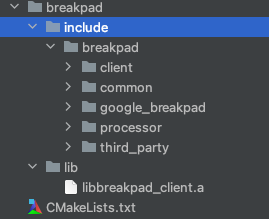

# breakpad_script

```shell
export CPPFLAGS="-D_LARGEFILE_SOURCE -D_LARGEFILE64_SOURCE -D_FILE_OFFSET_BITS=64"
export CFLAGS="-D_LARGEFILE_SOURCE -D_LARGEFILE64_SOURCE -D_FILE_OFFSET_BITS=64"
./configure --host=arm-linux-gnueabihf --prefix=`pwd`/output
```


